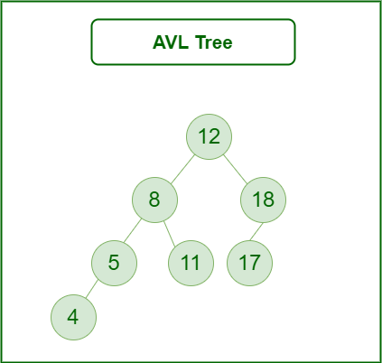

# Trees 

## Introduction

Trees are a fundamental data structure in computer science that simulate a hierarchical tree structure with a set of linked nodes. Each tree consists of nodes, with one node serving as the root from which all other nodes branch out. Trees are widely used in various applications, including databases, file systems, and search algorithms, due to their efficient data organization and retrieval capabilities.

## Types of Trees

### Binary Trees

A binary tree is a tree data structure in which each node has at most two children, referred to as the left child and the right child. This simple structure forms the basis for more complex trees.

### AVL Trees

An AVL tree is a self-balancing binary search tree. In an AVL tree, the heights of the two child subtrees of any node differ by at most one, ensuring that the tree remains balanced and operations are efficient.

 

## Tree Traversal

### In-order Traversal

In-order traversal visits the nodes of a binary tree in ascending order. The process is:

1. Traverse the left subtree.

2. Visit the root node.

3. Traverse the right subtree.

### Pre-order Traversal

Pre-order traversal visits the nodes in the following order:

1. Vist the root node.

2. Traverse the left subtreee.

3. Travsere the right subtree.

### Post-order Traversal

Post-order traversal visits the nodes in the following order:

1. Traverse the left subtree.

2. Traverse the right subtree.

3. Visit the root node.


## Use Cases

* **Binary Search Trees (BSTs):** Used in search operations where quick lookup, addition, and deletion of items are essential.

* **AVL Trees:** Used when the balance of a tree is crucial to maintain low time complexity for operations, such as in database indexing.

* **File Systems:** Trees are used to represent the hierarchy of files and directories.
Expression Trees: Used in compilers to represent expressions and facilitate the order of operations.

## Efficiency of Common Operations

* **Search:** 𝑂(log 𝑛) in balanced trees like AVL trees; 
𝑂(𝑛) in unbalanced trees.

* **Insertion:** 𝑂(log 𝑛) in balanced trees; 
𝑂(𝑛) in unbalanced trees. 

* **Deletion:** 
𝑂(log 𝑛) in balanced trees; 
𝑂(𝑛) in unbalanced trees. 

* **Traversal:**
𝑂(𝑛) for in-order, pre-order, and post-order reaversals.

## Example Problem

**Problem Statement:** Implement a binary search tree (BST) and include functions to insert a node, delete a node, and search for a node. Additionally, implement in-order, pre-order, and post-order traversal methods.

## Problem to Solve

**Task:** Write a program that constructs a binary search tree and performs the following operations based on user input:

1. Insert a node with a given value.

2. Delete a node with a given value.

3. Search for a node with a given value.

4. Display the tree using in-order, pre-order, and post-order traversal.

You can check your code with the solution here: [Solution](tree.solution.md)

**Example Execution:**

```csharp
1. Insert 5
2. Insert 3
3. Insert 7
4. Insert 2
5. Insert 4
6. Insert 6
7. Insert 8
8. Search 4
9. Delete 3
10. In-order Traversal
11. Pre-order Traversal
12. Post-order Traversal
13. Quit

Enter your choice: 1
Enter value to insert: 5
```

